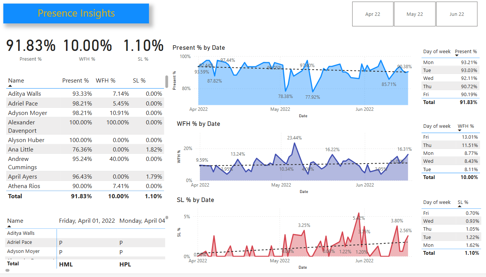

# HR Analytics Dashboard

This repository contains a Power BI report created for HR data analytics. The report is based on the Excel sheet `Attendance Sheet 2022-2023_Masked`, which includes employee attendance details such as:

- Percentage of days present
- Work from home percentage
- Sick leave percentage

The dashboard provides insightful graphs and visualizations to help analyze and understand employee attendance trends effectively. It is designed to assist HR professionals in identifying patterns, improving workforce management, and making data-driven decisions.

## Features

- Interactive visualizations for better understanding of attendance metrics.
- Filters to drill down into specific time periods or employee groups.
- Comprehensive analysis of attendance trends to identify areas of improvement.
- Easy-to-use interface for quick insights.
- Exportable reports for sharing insights with stakeholders.
- Customizable views to focus on specific metrics like absenteeism or productivity.
- Integration with external data sources for real-time updates.
- **Automated Updates**: The dashboard is designed to automatically update as new data is entered into the Excel sheet, ensuring real-time insights without manual intervention.

## Dashboard Preview



## Access the Report

[Click here to view the Power BI report](https://app.powerbi.com/reportEmbed?reportId=8ab0d3d4-4f7d-4582-8a14-ccb5771110c6&autoAuth=true&ctid=168c05fc-dcc7-4aa8-ae05-6c848fe9cfac)

## How to Use

1. **Download the Repository**  
   Clone this repository to your local machine using the following command:
   ```bash
   git clone https://github.com/your-username/hr-analytics-dashboard.git
   ```

2. **Open Power BI**  
   Open the Power BI Desktop application.

3. **Load Data**  
   Load the `Attendance Sheet 2022-2023_Masked` Excel file into Power BI.

4. **Import Dashboard**  
   Import the provided Power BI dashboard file (`.pbix`) into your Power BI Desktop.

5. **Customize**  
   Customize the dashboard as needed to fit your specific requirements.

6. **Publish to Power BI Service**  
   Publish the report to the Power BI Service for sharing with your team:
   - Go to **File > Publish > Publish to Power BI Service**.
   - Select your workspace and upload the report.

7. **Interact with the Dashboard**  
   Use the filters and slicers to explore the data and gain insights. Export visualizations or data as needed.

8. **Update Data**  
   Replace the Excel file with updated data, and the dashboard will automatically refresh to reflect the latest information.

## Automation Feature

This project includes a function that automates the process of updating the dashboard. As new data is entered into the `Attendance Sheet 2022-2023_Masked` Excel file, the dashboard automatically reflects the changes without requiring manual refresh. This ensures that the insights are always up-to-date and ready for analysis.


